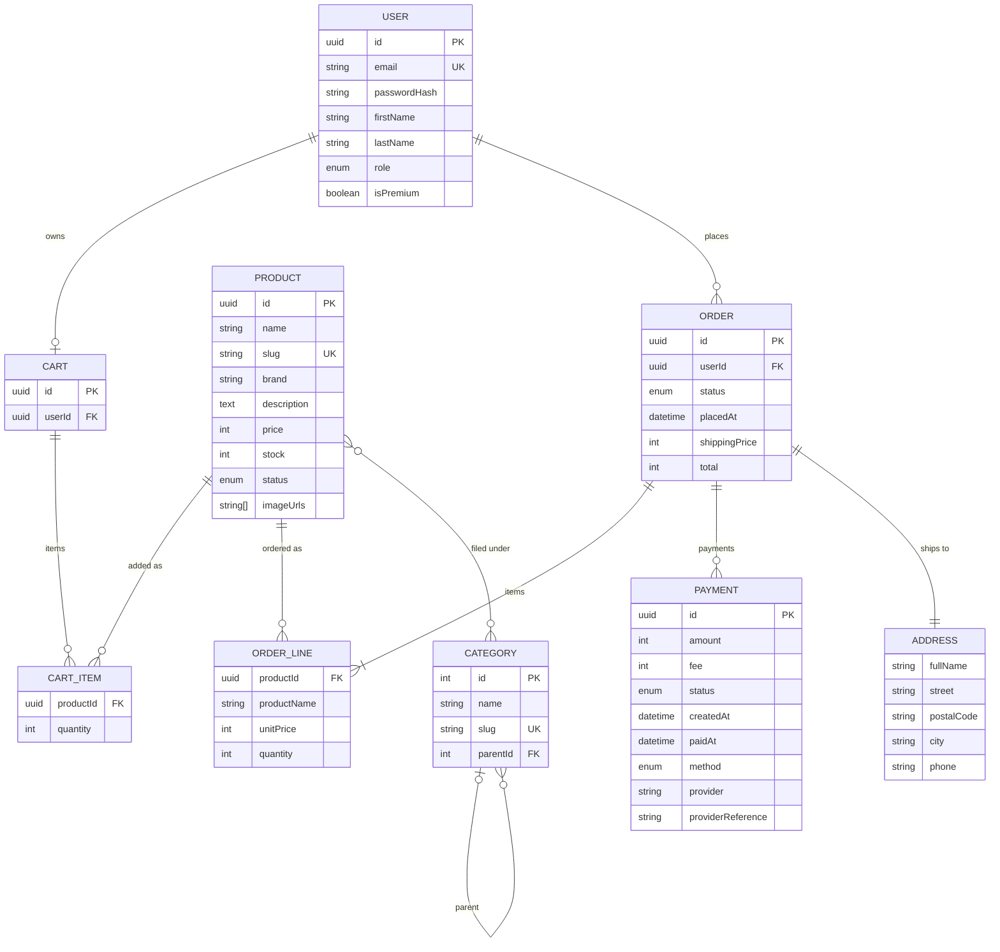

# Ronart-Shop — schemat

```mermaid
erDiagram
  USER ||--o| CART : owns
  CART ||--o{ CART_ITEM : items
  PRODUCT ||--o{ CART_ITEM : "added as"
  USER ||--o{ ORDER : places
  ORDER ||--|{ ORDER_LINE : items
  ORDER ||--o{ PAYMENT : payments
  ORDER ||--|| ADDRESS : "ships to"
  PRODUCT ||--o{ ORDER_LINE : "ordered as"
  PRODUCT }o--o{ CATEGORY : "filed under"
  CATEGORY |o--o{ CATEGORY : parent

  PRODUCT {
    uuid id PK
    string name
    string slug UK
    string brand
    text description
    int price
    int stock
    enum status
    string[] imageUrls
  }
  CATEGORY {
    int id PK
    string name
    string slug UK
    int parentId FK
  }
  USER {
    uuid id PK
    string email UK
    string passwordHash
    string firstName
    string lastName
    enum role
    boolean isPremium
  }
  CART {
    uuid id PK
    uuid userId FK
  }
  CART_ITEM {
    uuid productId FK
    int quantity
  }
  ORDER {
    uuid id PK
    uuid userId FK
    enum status
    datetime placedAt
    int shippingPrice
    int total
  }
  PAYMENT {
    uuid id PK
    int amount
    int fee
    enum status
    datetime createdAt
    datetime paidAt
    enum method
    string provider
    string providerReference
  }
  ORDER_LINE {
    uuid productId FK
    string productName
    int unitPrice
    int quantity
  }
  ADDRESS {
    string fullName
    string street
    string postalCode
    string city
    string phone
  }
```

Kreska przy kategorii to `parentId`: wskazuje `id` kategorii nadrzędnej. Mermaid rysuje ją przy pierwszych polach encji.
